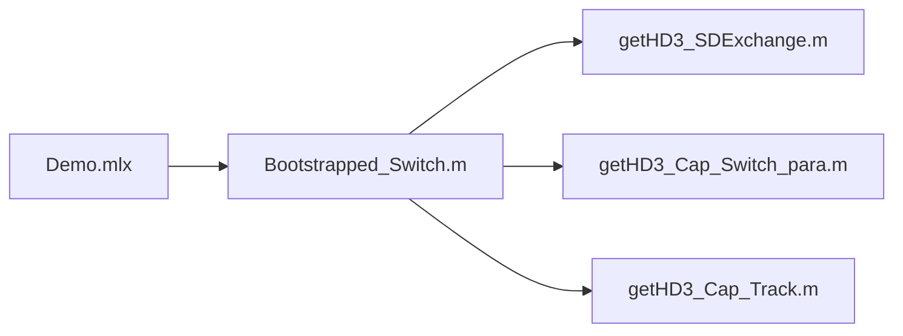

# Bootstrapped Switch Calculation Model

*Mathematical computational model for the linearity of the typical bootstrapped switches*

For use in publications and presentations please cite as follows:
J. Ma and Y. Hu, "Bootstrapped Switch Calculation Model," [Online]. Available: https://github.com/MMurphy98/Bootstrapped-Switch-Model.

```
@misc{Bootstrapped,
   author = {Ma, Jinge and Hu, Yuanqi},
   title = {{Bootstrapped Switch Calculation Model}},
   note = {[Online]. Available: \url{https://github.com/MMurphy98/Bootstrapped-Switch-Model}}
}
```

<p align="center">
  
</p>


The proposed calculation model of the bootstrapped switch is illustrated in Figure above. Here are some additional declarations of input and output parameters.

- `f_max` the maximum frequency of input signal;
- `C_L` the load of the switch;
- `V_0` the amplitude of the input signal;
- `THD` the target of the total distortion (THD);
- `Size_Array` is a structure variable representing the size of the switching transistor, which contains two fields: `Size_i` and `HD3_i`. Based on the calculations presented in the previous section, we determine the transistor size (`Size`) and the corresponding third harmonic distortion (`HD_SD`) value that meets THD requirements. We also provide the variation of HD3 within a certain range of the transistor size for special optimizations.
- `Capacitor_Array` is a structure variable representing the bootstrapped capacitor $C_b$, which is similar to `Size_Array`.
- `result` is a structure containing the total calculated results, which includes all design parameters such as the size of the switching transistor and the value of the bootstrapped capacitor. HD3 induced by three distortion mechanisms has also been contained. 

**Notes:** The model contains some parameters `VDD`, `VTH`, `alpha`, `Kn` related to semiconductor technology. We only provide reference values for 180 nm technology, which users would need to adjust according to their specific requirements.


### How to use it?

We provided the example in the `Demo.mlx` to design a 90dB-THD 2-MSPS Bootstrapped Switch, the relevant file calls are as follows:



The running results are presented as follows:
```
[r, size_array, cb_array] = Bootstrapped_Switch(Fin0, C1, V0, Target_THD)

>>> r = 
                 W: 12.2342
                Cb: 1.9454e-13
           HD3_tot: 89.1231
            HD3_SD: -94
    HD3_cap_switch: -93.5203
     HD3_cap_track: -104.9005

>>> size_array = 
    Size_i: [1.2234 1.6978 2.1722 2.6466 3.1210 3.5954 4.0697 4.5441 5.0185 5.4929 5.9673 6.4417 6.9161 7.3905 7.8648 8.3392 8.8136 9.2880 9.7624 10.2368 10.7112 11.1856 11.6599 12.1343 12.6087 13.0831 13.5575 14.0319 14.5063 14.9807 … ] (1×50 double)
     HD3_i: [-54 -59.6925 -63.9729 -67.4044 -70.2686 -72.7267 -74.8797 -76.7950 -78.5200 -80.0891 -81.5281 -82.8569 -84.0913 -85.2438 -86.3246 -87.3420 -88.3031 -89.2139 -90.0792 -90.9035 -91.6904 -92.4433 -93.1648 -93.8576 -94.5238 … ] (1×50 double)

>>> cb_array = 
     Cb_i: [1.9454e-14 2.6997e-14 3.4541e-14 4.2084e-14 4.9627e-14 5.7171e-14 6.4714e-14 7.2258e-14 7.9801e-14 8.7344e-14 9.4888e-14 1.0243e-13 1.0997e-13 1.1752e-13 1.2506e-13 1.3260e-13 1.4015e-13 1.4769e-13 1.5523e-13 1.6278e-13 … ] (1×50 double)
    HD3_i: [NaN -16.7934 -38.0673 -48.8438 -55.9837 -61.2791 -65.4652 -68.9142 -71.8395 -74.3749 -76.6092 -78.6044 -80.4055 -82.0460 -83.5514 -84.9418 -86.2333 -87.4385 -88.5682 -89.6310 -90.6343 -91.5843 -92.4862 -93.3447 -94.1636 … ] (1×50 double)

```
