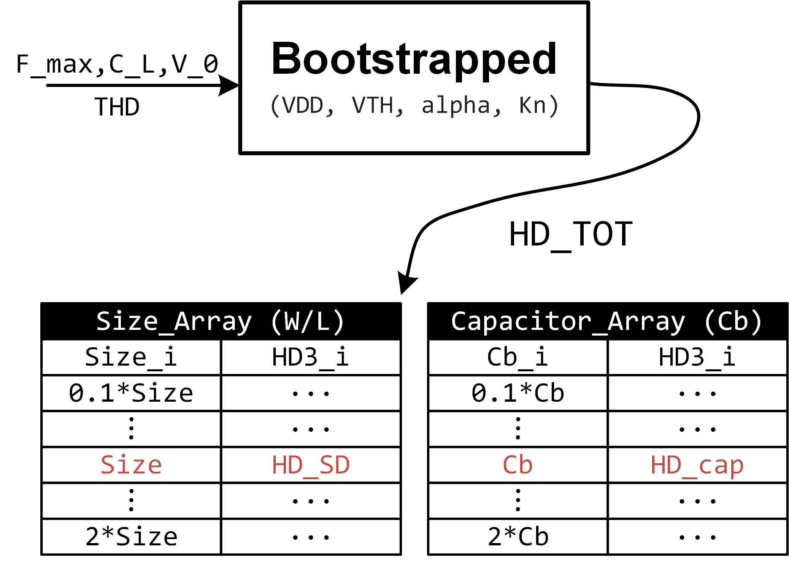

# Bootstrapped Switch Calculation Model

*Mathematical computational model for the linearity of the typical bootstrapped switches*

For use in publications and presentations please cite as follows:
J. Ma and Y. Hu, "Bootstrapped Switch Calculation Model," [Online]. Available: https://github.com/MMurphy98/Bootstrapped-Switch-Model.

```
@misc{adc_survey,
   author = {Ma, Jinge and Hu, Yuanqi},
   title = {{Bootstrapped Switch Calculation Model}},
   note = {[Online]. Available: \url{https://github.com/MMurphy98/Bootstrapped-Switch-Model}}
}
```

<p align="center">
  
</p>

The proposed calculation model of the bootstrapped switch is illustrated in Figure above. Here are some additional declarations of input and output parameters.

- `f_max` the maximum frequency of input signal;
- `C_L` the load of the switch;
- `V_0` the amplitude of the input signal;
- `THD` the target of the total distortion (THD);
- `Size_Array` is a structure variable representing the size of the switching transistor, which contains two fields: `Size_i` and `HD_i`. Based on the calculations presented in the previous section, we determine the transistor size (`Size`) and the corresponding third harmonic distortion (`HD_SD`) value that meets THD requirements. We also provide the variation of HD3 within a certain range of the transistor size for special optimizations.
- `Capacitor_Array` is a structure variable representing the bootstrapped capacitor $C_b$, which is similar to `Size_Array`.
- `HD_TOT` is the total HD3 performance contributing from all distortion sources.

**Notes:** The model contains some parameters `VDD`, `VTH`, `alpha`, `Kn` related to semiconductor technology. We only provide reference values for 180 nm technology, which users would need to adjust according to their specific requirements.
    